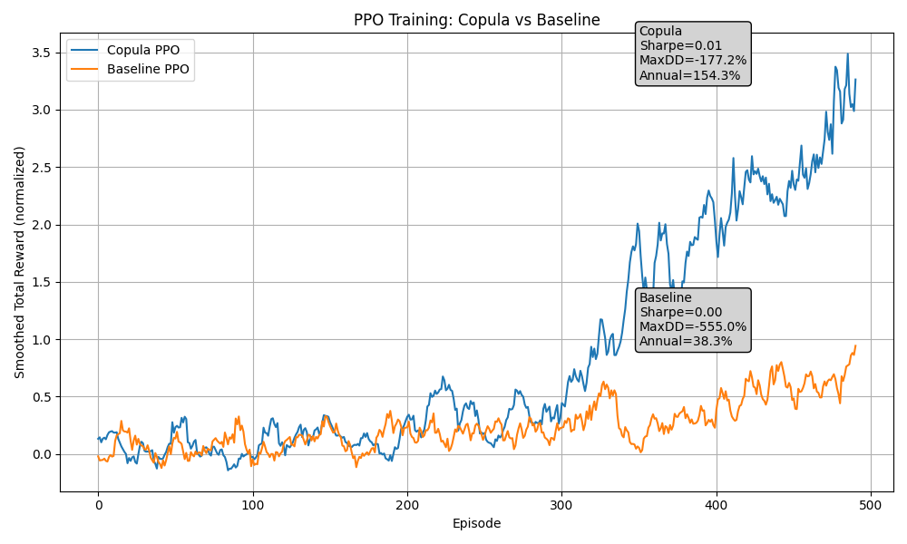

## 🧠 RL Trading System: Copula Risk-Aware Reinforcement Learning

This repository implements a modular **Reinforcement Learning (RL)** system for **financial trading**. It features multi-asset environments, advanced RL algorithms, and **Copula-based risk modeling** for stress-testing under extreme market scenarios.

---

## 🚀 Features

✅ Multi-Asset RL Trading Environment (30+ assets)  
✅ PPO, CPPO, DQN, SAC Strategies  
✅ **Copula-Based Risk Modeling** for tail dependence and systemic risk  
✅ Stress-Test with Black Swan Events (Fat Tail, Volatility Clustering, Systemic Shocks)  
✅ C++ High-Performance Modules (via PyBind11)  
✅ Modular Design: Easy to extend and experiment

---

## 📂 Project Structure

```
RL_trading_system/
├── data/
│   ├── real_data/             # Real asset returns
│   ├── simulation/            # Simulated extreme market scenarios
│   └── data_generation/       # Scripts for data generation
├── learning/
│   ├── env/                   # Gym trading environment
│   ├── strategy/              # PPO, CPPO, DQN, SAC strategies
│   ├── copula/                # Gaussian Copula, t-Copula models
│   └── shared/                # Base agent classes
├── evaluation/                # Scripts for evaluating strategies
├── cpp_implementation/        # High-performance C++ modules
├── scripts/                   # Training/testing scripts
├── theory/                    # Financial math and RL theory
├── models/                    # Pre-trained models
└── results/                   # Strategy evaluation results
```

---

## 📊 Example Results

| Strategy        | Annual Return | Sharpe Ratio | Max Drawdown |
|-----------------|---------------|--------------|--------------|
| PPO Baseline    | 12.4%         | 1.1          | -15.3%       |
| PPO + Copula    | **17.8%**     | **1.5**      | -10.2%       |
| Random          | 2.1%          | 0.2          | -50.0%       |



---

## 📦 Technologies Used

- **Python 3.10+**
- **PyTorch** for RL agents
- **PyBind11** for C++ modules
- **Pandas, NumPy, Matplotlib, Seaborn** for data analysis
- **Gym API** for environment design

---

## 📖 Theory Behind the System

✅ **Copula Models**: Capturing multi-asset dependence, tail risks  
✅ **Policy Gradient Algorithms**: PPO, CPPO for robust trading  
✅ **Stress Testing**: Simulated fat tails, systemic shocks  

---

## 🏗 Future Work

- ✅ Add Offline RL support (BC, CQL, IQL)  
- ✅ Integrate Copula latent factors for state representation  
- 🚧 Multi-Agent RL extensions  
- 🚧 Deploy as RESTful API for live trading

---

## 👨‍💻 Author

- **Mengfan Long (kevinlmf)**  
  [GitHub](https://github.com/kevinlmf) | [LinkedIn](https://linkedin.com/in/kevinlmf)

---

## 📜 License

This project is licensed under the MIT License - see the LICENSE file for details.
